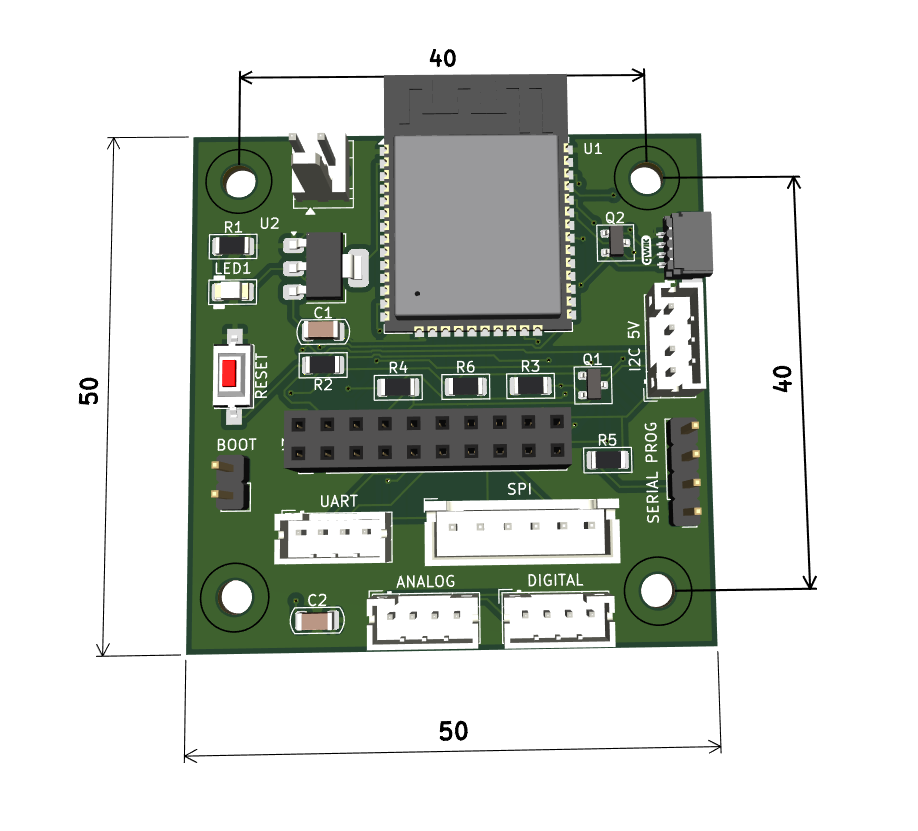

# ESP32 MultiBoard

The ESP32 MultiBoard is a custom board that helps makers to connect an ESP32 with all kind of sensors and actuators, using most common connectors such as Qwiic and Grove. 

---

## Pinout

---
---

## 🧩 Specifications

- **Power Supply:** 5V DC input  
- **Qwiic Connector:** For I²C peripherals (3,3V)  
- **Grove Connectors:**
  - UART type (TX/RX communication)
  - Analog type
  - Digital type
  - I²C (5V compatible)  
- **Pin Header:** For expansion modules or shields  
- **ESPHome Compatible:** Designed to easily integrate with ESPHome-based devices and automation platforms.   

---

---

