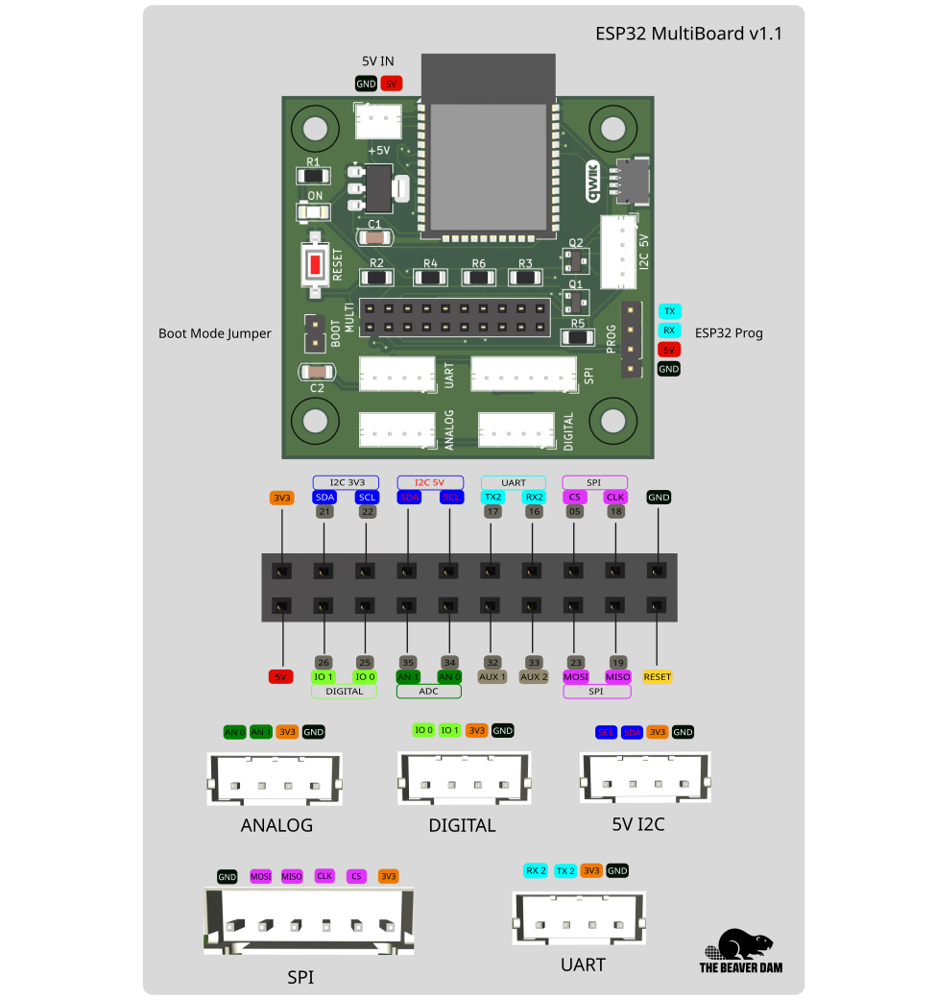
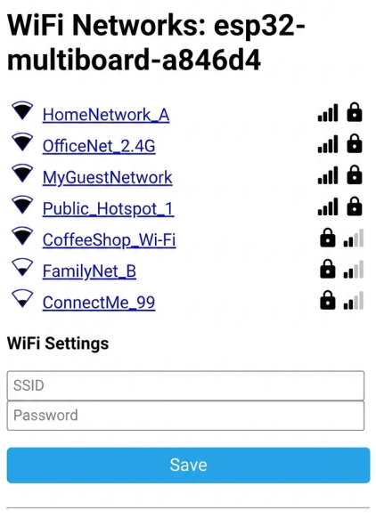
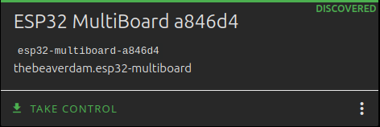
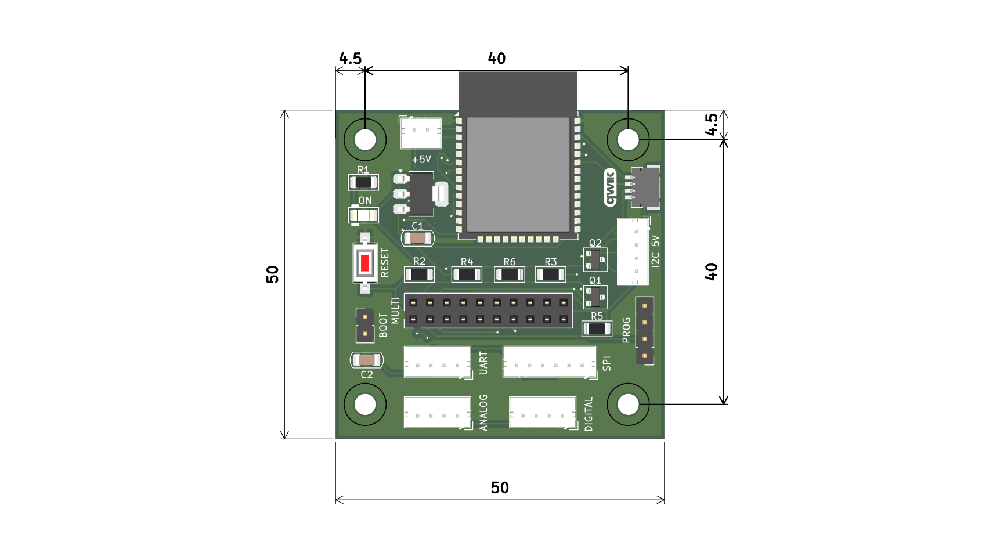

# ESP32 MultiBoard

The ESP32 MultiBoard is a custom board that helps makers to connect an ESP32 with all kind of sensors and actuators, using most common connectors such as Qwiic and Grove. 

A serial adapter is needed for programming the board for the first time. Once configured, you can update the new code via OTA in ESPHome or Arduino IDE.
  

## Connector Specifications
### Grove Digital

Ideal for binary sensors, actuators, or general-purpose digital I/O.
| Pin | Function | ESP32 GPIO | Notes |
| :--- | :--- | :--- | :--- |
| 1 | GND | GND | System Ground |
| 2 | VCC | 3V3 | 3.3V Power Supply |
| 3 | IO_0 | GPIO 25 | Supports DAC Output / Digital I/O |
| 4 | IO_1 | GPIO 26 | Supports DAC Output / Digital I/O |

### Grove Analog

Designed for interfacing with analog sensors via ADC.
| Pin | Function | ESP32 GPIO | Notes |
| :--- | :--- | :--- | :--- |
| 1 | GND | GND | System Ground |
| 2 | VCC | 3V3 | 3.3V Power Supply |
| 3 | AN 1 | GPIO 35 | Input Only (ADC1_CH7) |
| 4 | AN 0 | GPIO 34 | Input Only (ADC1_CH6) |

    Note: GPIOs 34 and 35 do not have internal pull-up/down resistors and cannot be used as outputs.

### Grove UART

For serial communication with modules like GPS, CO2 sensors, or MIDI devices.
| Pin | Function | ESP32 GPIO | Notes |
| :--- | :--- | :--- | :--- |
| 1 | GND | GND | System Ground |
| 2 | VCC | 3V3 | 3.3V Power Supply |
| 3 | TX | GPIO 17 | Transmit (UART2 TX) |
| 4 | RX | GPIO 16 | Receive (UART2 RX) |

### Qwiic Connector (I2C)

Standard 4-pin JST-SH 1.0mm connector for I2C daisy-chaining.
| Pin | Function | ESP32 GPIO | Notes |
| :--- | :--- | :--- | :--- |
| 1 | GND | GND | System Ground |
| 2 | VCC | 3V3 | 3.3V Power Supply |
| 3 | SDA | GPIO 21 | I2C Data (Default) |
| 4 | SCL | GPIO 22 | I2C Clock (Default) |

### SPI Connector

Standard 6-pin JST-PH 2.0mm connector for SPI interface.
| Pin | Function | ESP32 GPIO | Notes |
| :--- | :--- | :--- | :--- |
| 1 | VCC | 3V3 | 3.3V Power Supply |
| 2 | CS | GPIO 05 | Chip Select |
| 3 | CLK | GPIO 18 | Clock |
| 4 | MISO | GPIO 19 | Input |
| 5 | MOSI | GPIO 23 | Output |
| 6 | GND | GND | System Ground |

---
---

## Pinout

---

  

You can also purchase the board with the basic [ESPhome firmware](firmware/ESPHome.yml) installed. This helps users to easy adopt the board in Home Assistant without using any serial adapter.
Follow this steps to configure your board:

1. Connect the board to a 5V power supply. Using a mobile device, search for the "Setup_MultiBoard" network to configure your home Wi-Fi settings. If your device don´t shows the captive portal, navigate to the IP 192.168.4.1
  

2. Once configured, the ESPHome Dashboard will detect the board and provide the option to "Adopt" it.
  

3. Now, you are all set to edit the code to your liking!

  
## Examples

[AM3202 with Oled Display](firmware/AM2303%20Oled%20Display/README.md)

  

---

