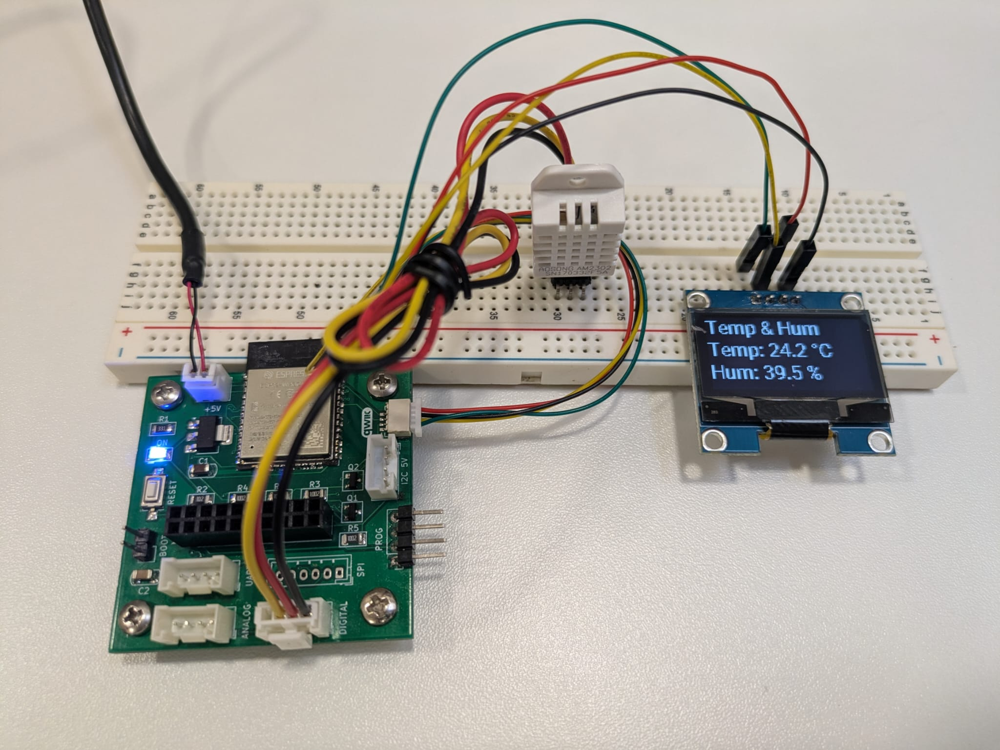

# AM2303 / DHT22 with OLED Display

This example monitors temperature and humidity using an AM2303 (DHT22 compatible) sensor and displays the readings on a 1.3" I2C OLED display.




## Features

- Real-time temperature and humidity monitoring.
- High-resolution data output to a 1.3" OLED display (SH1106 model).

## Hardware Components

- **Sensor**: AM2303 (DHT22) Temperature and Humidity sensor.
- **Display**: 1.3" OLED Display (I2C, SH1106 driver, 128x64 resolution).

## Wiring Diagram

| Component | ESP32 Multiboard|
| :--- | :--- |
| **AM2303 (DHT22)** | Digital Grove |
| **OLED Display** | QWIIC |


## Configuration Details


```yaml
sensor:
  - platform: dht
    pin: 26
    model: AM2302 # AM2303 is usually compatible with AM2302/DHT22 settings
    temperature:
      name: "Temperature"
      id: temp
    humidity:
      name: "Humidity"
      id: hum
    update_interval: 1s
```

- **Sensor**: Uses the `dht` platform on pin 26. Although it's an AM2303, it uses the `AM2302` model setting for compatibility.


```yaml
display:
  - platform: ssd1306_i2c
    model: "SH1106 128x64" # 1.3" displays are often SH1106
    address: 0x3C
    lambda: |-
      it.print(0, 0, id(my_font), "Temp & Hum");
      if (id(temp).has_state()) {
        it.printf(0, 20, id(my_font), "Temp: %.1f °C", id(temp).state);
      }
      if (id(hum).has_state()) {
        it.printf(0, 40, id(my_font), "Hum: %.1f %%", id(hum).state);
      }

```


- **Display**: Uses `ssd1306_i2c` with the `SH1106 128x64` model.
- **Display Logic (Lambda)**:
    - Prints "Temp & Hum" as a header.
    - Displays temperature in °C and humidity in % with one decimal place.


